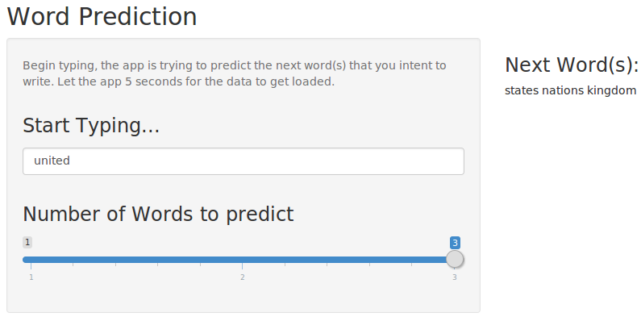

Data Science Specialization SwiftKey Capstone
========================================================
author: Georgios Kyritsis 
date: 5 Apr 2015

Overview
========================================================

**Swiftkey** is an input method for Android and iOS devices such as smartphones and tables. Swiftkey uses a blend of artificial intelligence technologies that enable it to predict the next word the user intents to write.

The ultimate **goal** of this project is to mimic the SwiftKey keyboard and predict the next word the user intents to write.

The shiny application can be found [here](https://georgioskyritsis.shinyapps.io/predictNextWords/)

Algorithm
========================================================

To predict the next word that the user intents to type, we find from the text files (blogs, news, twitter) the ngrams. The steps that we followed are:

- Get the data provided by Swiftkey
- Sample the data
- Clean the Data (Remove numbers, punctuation)
- Calculate bigrams, trigrams, fourgrams, and fivegrams
- Build frequency tables
- Build a function that searches through the corresponding frequency table to find the next word(s) that the user is likely to type.

Shiny App
========================================================

The application is reactive. The user types a message inside the cell and the app automatically updates the next word(s). The user can select the number of words to be displayed.

Conclusion
========================================================

It is obvious that the accuracy of the prediction depends largely on the training dataset. So in order to increase the accuracy of the app, we enchanced the dataset that we constructed from blogs, news, and twitter with more datasets that we found in the internet.

